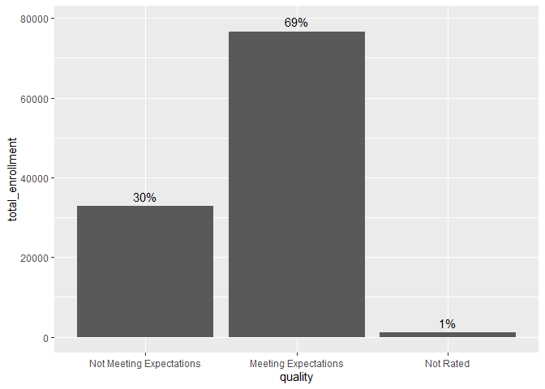

Wisconsin K12 School Data
================
Spencer Schien
2019-12-16

# Introduction

The `wisconsink12` package was developed to increase the accessibility
of publicly available data regarding K12 schools in Wisconsin and to
facilitate analysis of that data.

The data is organized in a relational database structure, where each
table has a unique school identifier that facilitates joins. As of this
writing, the following data tables are included:

  - `schools` – This is a list of all schools in Wisconsin that serves
    as the unique identifier table for the relational database.
  - `enrollment` – This table contains enrollment data for all Wisconsin
    schools. Disaggregated enrollment data is not available for private
    schools.
  - `forward_exam` – This table contains forward exam results for public
    and Choice-participating private schools. Disaggregated test results
    are not available for private schools.
  - `graduation` – This table contains graduation and completion data
    for all public schools. Private schools are not included here at all
    because cohort counts are not available for private schools, and so
    rates cannot be calculated.
  - `report_cards` – This table contains Report Card data from all
    schools in Wisconsin.

# Installation

As of this writing, there are no plans to submit the `wisconsink12`
package to CRAN, so it must be downloaded from City Forward Collective’s
[GitHub repository](https://github.com/cityforwardcollective). This can
be achieved with the following code.

``` r
# The devtools package is required
# to download from GitHub.
# install.packages("devtools")

devtools::install_github("cityforwardcollective/wisconsink12")
```

# Accessing the Data

## Milwaukee School Report Cards

The `wisconsink12` package is built around the school data it makes
available. This data is organized into tables (listed above), and each
table contains a school ID field called the `dpi_true_id`. This field is
a concatenation of a school’s District Code and its School Code, with an
underscore ’\_’ in between. Both codes are padded with zeros on the left
to a length of four, and choice schools are given a District Code of
‘0000’.

Once the `wisconsink12` package is loaded, a message will be displayed
listing the tables that are available.

``` r
# Trying to access tables before loading
# the package will result in an error.

# Load the package, then access the tables.

library(wisconsink12)
```

As the output shows, we indeed have access to the five tables listed
above. We can inspect these tables as we would any dataframe.

``` r
# Inspect the `schools` table

str(schools)
#> 'data.frame':    3237 obs. of  11 variables:
#>  $ locale_description  : chr  NA NA NA "NA" ...
#>  $ city                : chr  NA NA NA "La Crosse" ...
#>  $ dpi_true_id         : chr  "0000_0005" "0000_0052" "0000_0057" "0000_0070" ...
#>  $ school_name         : chr  "Abbotsford Christian Academy" "Hillside Amish School" "Amish Parochial Schools" "Aquinas Middle" ...
#>  $ agency_type         : chr  "Private school" "Private school" "Private school" "Private school" ...
#>  $ district_name       : chr  "Abbotsford" "Medford Area Public" "Granton Area" "La Crosse" ...
#>  $ county              : chr  "Clark" "Taylor" "Clark" "La Crosse" ...
#>  $ choice_indicator    : int  0 0 0 1 1 0 1 0 1 0 ...
#>  $ charter_indicator   : int  0 0 0 0 0 0 0 0 0 0 ...
#>  $ accurate_agency_type: chr  "Private School" "Private School" "Private School" "Private School" ...
#>  $ last_year_open      : chr  "2018-19" "2018-19" "2018-19" "2018-19" ...
```

If you get further along after loading the package and you forget what
tables are available, you can access that information with the
`list_tables()` function.

``` r
# List the tables available in the 
# `wisconsink12` package.

list_tables()
#> [1] "schools"      "enrollment"   "report_cards" "forward_exam" "graduation"
```

# Most Common Uses

There are a few slices of this data that will be a starting point for
any analysis the vast majority of the time. For example, you might want
to perform an analysis on Report Card outcomes for Milwaukee schools. To
easily filter for these schools, you can use the `make_mke_rc()`
function.

``` r
# Call `make_mke_rc()` to create two tables:
# `mke_schools` table and `mke_rc` table 

make_mke_rc()
#> Choosing 'Private - Choice Students' report card type for private schools.

# List environment objects with `ls()`

ls()
#> [1] "mke_rc"      "mke_schools"
```

The primary result of this function is to create `mke_rc`, a table of
Report Card data filtered for Milwaukee schools. A secondary result is
the creation of the `mke_schools` table, which contains a unique list of
Wisconsin schools along with certain information on those schools such
as agency type, last year the school was open, etc.

An important item to note is that private schools participating in a
parental choice program in Wisconsin are required to have a report card
for their students attending with voucher funds, and they have the
option to receive a report card for all of their students. The functions
in the `wisconsink12` package by default filter for the choice students
(designated as the *Private - Choice Students* report card in the
`report_card_type` field of the `report_cards` table). This filter can
be changed with the `private_type` argument – setting it as “all” would
filter for the *Private - All Students* report card.

``` r
# make_mke_rc() was run above, 
# with default private_type = "choice"

# Examine unique report card types

unique(mke_rc$report_card_type)
#> [1] NA                          "Private - Choice Students"
#> [3] "Public - All Students"

# Call make_mke_rc() again, 
# with default private_type = "s"

make_mke_rc(private_type = "all")
#> Choosing 'Private - All Students' report card type where available for private schools.

# Examine unique report card types

unique(mke_rc$report_card_type)
#> [1] NA                          "Private - Choice Students"
#> [3] "Private - All Students"    "Public - All Students"
```

We see from the two `unique()` calls that `NA` values remain in both
instances – this is because this field didn’t exist for the 2015-16
Report Cards since no private schools had scores computed that year. We
also see that the second `unique()` call still shows *Private - Choice
Students* among the unique values, even though we set `private_type` to
“all”. This is because designating “all” chooses the *Private - All
Students* report card type *when it is available* – as mentioned above,
schools only have that report card type if they elect to do so.

``` r
make_mke_rc()

library(knitr) # `knitr` needed for `kable()` below
library(tidyverse) # tidyverse will be used throughout

table(mke_rc$report_card_type, mke_rc$school_year) %>%
  kable()
```

|                           | 2015-16 | 2016-17 | 2017-18 | 2018-19 |
| ------------------------- | ------: | ------: | ------: | ------: |
| Private - Choice Students |       0 |      89 |      89 |      87 |
| Public - All Students     |       0 |     176 |     178 |     180 |

## How many students are in schools that *Meet Expectations*?

Now that we have our `mke_rc` table, let us ask how many students are
enrolled\[1\] in schools that are rated *Meets Expectations* or higher.

``` r
# Designate which ratings fall below 'Meeting Expectations'

low_performers <- c("Alternate Rating - Needs Improvement",
                    "Fails to Meet Expectations",
                    "Fails to Meed Expectations^",
                    "Meets Few Expectations",
                    "Meets Few Expectations^")

# Designate which ratings should be excluded from buckets

not_rated <- c("Not Rated",
               "NR-DATA")

# Create `quality` field that designates meeting expecs or not

meets_expecs <- mke_rc %>%
  filter(school_year == "2018-19") %>%
  mutate(quality = ifelse(overall_rating %in% low_performers, "Not Meeting Expectations", 
                          ifelse(overall_rating %in% not_rated, "Not Rated", "Meeting Expectations"))) %>%
  modify_at("quality", factor, levels = c("Not Meeting Expectations",
                                          "Meeting Expectations",
                                          "Not Rated")) %>%
  group_by(quality) %>%
  summarise(total_enrollment = sum(school_enrollment)) %>%
  
  # Calculate percentage of total
  
  mutate(percent = scales::percent(total_enrollment/sum(total_enrollment)))

# Return the data to inspect it

meets_expecs
#> # A tibble: 3 x 3
#>   quality                  total_enrollment percent
#>   <fct>                               <dbl> <chr>  
#> 1 Not Meeting Expectations            32834 30%    
#> 2 Meeting Expectations                74813 69%    
#> 3 Not Rated                             311 0%

# Visualize with bar graphs

meets_expecs %>%
  ggplot(aes(quality, total_enrollment)) +
  geom_col()
```

<!-- -->

As we can see, nearly 7/10 students in Milwaukee are in schools that
receive a rating of *Meets Expectations* or higher.

## How Many Choice and Charter Schools are in Milwaukee?

1.  Note that enrollment is a tricky number to pin down in some cases,
    and the easiest way to do this at the city-wide level is to use
    numbers included in the Report Card data release. ***Still being
    updated…***
